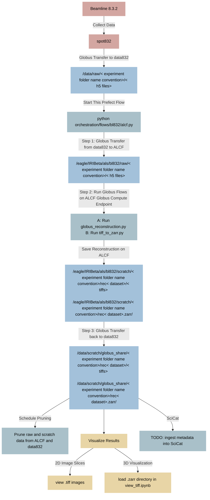

# 8.3.2 ALCF Globus Flow And Reconstruction Setup

This document outlines the steps required to set up and run Globus Transfer and Compute Flows for transferring and processing raw tomography data from Beamline 8.3.2 at Berkeley Lab's Advanced Light Source (ALS) to the Argonne Leadership Computing Facility (ALCF). This script relies on Prefect for workflow orchestration, Globus Transfer for data movement between facilities, and Globus Compute at ALCF for tomographic reconstruction using Tomopy.

Follow these steps to log in to ALCF Polaris, start a Globus compute endpoint signed in using a Globus confidential client, register a reconstruction function and flow, and run the flow using [`orchestration/flows/bl832/alcf.py`](orchestration/flows/bl832/alcf.py).

## Index
- [Details](#details)
	- [Data flow diagram](#data-flow-diagram)
	- [File flow details](#file-flow-details) 
	- [Globus Compute Flow](#globus-compute-flow)
	- [Reconstruction](#reconstruction)
	- [Zarr Generation](#zarr-generation)
	- [Pruning](#pruning) 
- [Set up](#set-up) 
	- [Requirements](#requirements) 
	- [On Polaris](#on-polaris) 
	- [In your local environment](#in-your-local-environment) 
	- [Register Globus Compute Functions and Flows](#register-globus-compute-functions-and-flows)
	- [Schedule Pruning with Prefect Workers](#schedule-pruning-with-prefect-workers)
- [Helper Scripts](#helper-scripts)
- [Performance](#performance)

# Details
## Data flow diagram


## File flow details
**Naming conventions**
-   Experiment folder name:
	- `< Proposal Prefix>-< 5 digit proposal number>_< first part of email address>/`
-   h5 files in experiment folder:
	- `< YYYYMMDD>_< HHMMSS>_< user defined string>.h5`
-   h5 files for tiled scans:
	- `< YYYYMMDD>_< HHMMSS>_< user defined string>_x<##>y<##>.h5`

**data832 Raw Location**
- `data/raw/< Experiment folder name convention>/< h5 files>`

**data832 Scratch Location**
- `data/scratch/globus_share/< Experiment folder name convention>/rec< dataset>/< tiffs>`
- `data/scratch/globus_share/< Experiment folder name convention>/rec< dataset>.zarr/`

**ALCF Raw Location**
- `/eagle/IRIBeta/als/bl832/raw/< Experiment folder name convention>/< h5 files>`

**ALCF Scratch Location**
- `/eagle/IRIBeta/als/bl832/scratch/< Experiment folder name convention>/rec< dataset>/< tiffs>`
- `/eagle/IRIBeta/als/bl832/scratch/< Experiment folder name convention>/rec< dataset>.zarr/`

## Globus Compute Flows

The preferred method for scheduling jobs on ALCF is through Globus Compute. This is done by registering a function containing the code to run with Globus Compute Flows, which will then be called when running the reconstruction on ALCF. Two scripts are included in this repository that set up reconstruction and Zarr conversion Globus Compute Flows:

- **Reconstruction**
	- [`/scripts/init_reconstruction_globus_flow.py`](/scripts/init_reconstruction_globus_flow.py)
	- `reconstruction_wrapper()` defines the function registered with Globus Compute.
- **Tiff to Zarr**
	- [`/scripts/init_tiff_to_zarr_globus_flow.py`](/scripts/init_tiff_to_zarr_globus_flow.py)
	- `conversion_wrapper()` defines the function registered with Globus Compute.


### Reconstruction

The `globus_reconstruction.py` script in this flow is a slightly modified version of Dula Parkinson's tomography reconstruction code.  The modifications update the function's input parameters and set proper file/folder permissions for the reconstructed data.

- Location in this repo: [`/scripts/polaris/globus_reconstruction.py`](/scripts/polaris/globus_reconstruction.py)
- Location on Polaris: `/eagle/IRIBeta/als/example/globus_reconstruction.py`

### Zarr Conversion

Once the raw data has been reconstructed into a series of .tiff images, the script `tiff_to_zarr.py` transforms the images into a multiresolution .zarr directory, enabling 3D visualization. This code was adapted from the `view_tiff.ipynb` notebook and converted into a Python module. 

- Location in this repo: [`/scripts/polaris/tiff_to_zarr.py`](/scripts/polaris/tiff_to_zarr.py)
- Location on Polaris: `/eagle/IRIBeta/als/example/tiff_to_zarr.py`

## Pruning

After reconstruction is complete and data has moved back to NERSC/ALS, Prefect flows are scheduled to delete raw scratch paths at each location after a few days. Make sure to move the reconstructed data elsewhere before pruning occurs.

- **ALCF** 
	- Purge `raw` and `scratch` after 2 days
- **data832**
	- `/data/scratch/globus_share/< folder name convention>/rec< dataset>/< tiffs>`
	- `/data/scratch/globus_share/< folder name convention>/rec< dataset>.zarr/`
	- Purge `scratch` after 3 days

# Set up

A few steps are required to configure the environments locally and on ALCF Polaris.

## Requirements:

Some of the steps refer to code and notebooks provided in the git repository `als-computing/als_at_alcf_tomopy_compute`. Download/clone this repository as it will come in handy:

 - https://github.com/als-computing/als_at_alcf_tomopy_compute

Specifically, from here you will need: `Tomopy_for_ALS.ipynb`, and `template_config.yaml`.

Additionally, if you do not already have an ALCF account, follow the steps here to request access:
- https://docs.alcf.anl.gov/account-project-management/accounts-and-access/user-account-overview/

If you have not used Prefect before, it may be worthwhile to familiarize yourself with the documentation:
- https://docs.prefect.io/latest/

You will also need to update the included `.env.example` file (rename it `.env`) with particular endpoints, IDs, and secrets, which are annotated below along with the steps they correspond to:

### **.env.example**
```python
# Used by Python script to sign into Globus using confidential client
GLOBUS_CLIENT_ID="< Client UUID from step 3 >"
GLOBUS_CLIENT_SECRET="< Client Secret from step 3"
# These set environment variables to sign into globus-compute-endpoint environment using confidential client
GLOBUS_COMPUTE_CLIENT_ID="< Client UUID from step 3 >"
GLOBUS_COMPUTE_CLIENT_SECRET="< Client Secret from step 3"
# globus-compute-endpoint UUID
GLOBUS_COMPUTE_ENDPOINT="< globus-compute-endpoint ID from step 6 >"
# Reconstruction function and flow ID generated in Tomopy_for_ALS.ipynb 
GLOBUS_RECONSTRUCTION_FUNC="< Reconstruction function id from step 8 >"
GLOBUS_FLOW_ID="< Flow ID from step 9 >"
GLOBUS_IRIBETA_CGS_ENDPOINT="< IRIBeta_als guest collection UUID on Globus >"
PREFECT_API_KEY="< your key for your Prefect server's API >"
PREFECT_API_URL="< url to your Prefect server's API >"
```

### Prefect Secret Blocks
In addition to storing UUIDs in a `.env` file, we utilize Prefect's Secret Blocks. These can be configured in Prefect's user interface. The `.env` is great for managing secrets locally, but the Secret Blocks are handy for deployment and maintainability.

1. Navigate to your Prefect server instance. In production at 8.3.2 (flow-prd.als.lbl.gov). Prefect cloud (https://app.prefect.cloud/), or local server (http://127.0.0.1:4200).
2. On the left column, navigate to "Configuration --> Blocks"
3. In the "Blocks" Window, hit the "+" plus sign next to the word "Blocks"
4. Search for "Secret" and create a "Secret Block"
5. Create the following secrets, and set their values to the corresponding UUID string:
	```- globus-client-id
	- globus-client-secret
	- globus-compute-endpoint
	- globus-reconstruction-function
	- globus-reconstruction-flow-id
	- globus-tiff-to-zarr-function
	- globus-tiff-to-zarr-flow-id
	- globus-iribeta-cgs-endpoint
	```

## On Polaris:
1. **SSH into Polaris**
	
	Login to Polaris using the following terminal command:
	
	```bash
	ssh <your ALCF username>@polaris.alcf.anl.gov
	```
	Password: copy passcode from MobilePASS+

2. **Copy and Update endpoint template_config.yaml file**

	 From the `als-computing/als_at_alcf_tomopy_compute` repository, copy `template_config.yaml` into your home directory on Polaris (`eagle/home/<your ALCF username>`).

	Ex: using vim on Polaris
	- `vim template_config.yaml`
	- Paste file contents once the editor opens up
	- To save, type:
		- `:wq!` and press enter.
	- The view should switch back to the command line.

	**Note:** template_config.yaml needs to be updated to account for the new version of globus-compute-endpoint:
  
	What you need to change is that you should replace this:  
	```yaml
	strategy:
	    max_idletime: 300
	    type: SimpleStrategy
	type: GlobusComputeEngine
	```
	with this:  
	
	```yaml
	strategy: simple
	job_status_kwargs:
	    max_idletime: 300
	    strategy_period: 60
	type: GlobusComputeEngine
	```

	These new settings also introduce a parameter "strategy_period" that controls the frequency with which the endpoint checks pbs for completed jobs. The default was 5 seconds, and this change makes it 60 seconds.

3. **Use an existing Globus Confidential Client, or create a new one**

	- In your browser, navigate to globus.org
	- Login
	- On the left, navigate to "Settings"
	- On the top navigation bar, select "Developers" 
	- On the right under Projects, select "IRIBeta" (or create a new project)
	- Select a registered app (`dabramov ALCF Globus Flows Test`), or create a new one
	- Generate a secret
	- Store the confidential client UUID and Secret (note: make sure you copy the Client UUID and **not** the Secret UUID)

	**Note:** If you create a new service client, you will need to get permissions set by the correct person at ALCF, NERSC or other facility to be able to use it for transfer endpoints.
	
4. **Log into globus-compute-endpoint on Polaris with the service confidential client**

	In your terminal on Polaris, set the following global variables with the Globus Confidential Client UUID and Secret respectively. Check the documentation here for more information (https://globus-compute.readthedocs.io/en/stable/sdk.html#client-credentials-with-clients). Globus-compute-endpoint will then log in using these credentials automatically:
		
	```bash
	export GLOBUS_COMPUTE_CLIENT_ID="<UUID>"
	export GLOBUS_COMPUTE_CLIENT_SECRET="<SECRET>"
	```
	**Note**: you can make sure you are signed into the correct account by entering:

		globus-compute-endpoint whoami

	If you are signed into your personal Globus account, make sure to sign out completely using:

		globus-compute-endpoint logout

5. **Start globus-compute `tomopy` environment and activate the endpoint**
		On Polaris, enter the following commands to activate a Conda environment configured to run reconstruction using `tomopy` and `globus-compute-endpoint`.
	```bash
	module use /soft/modulefiles
	module  load  conda
	conda  activate  /eagle/IRIBeta/als/env/tomopy
	globus-compute-endpoint  configure  --endpoint-config  template_config.yaml  als_endpoint
	globus-compute-endpoint  start  als_endpoint
	globus-compute-endpoint  list
	```		
	This will create an endpoint and display its status. Its status should be listed as `running`. There will also be displayed a unique Endpoint ID in the form of a UUID.

	**Optional**: Create a new file called `activate_tomopy.sh`	in your home directory on Polaris and copy the following code:
	```bash
	#!/bin/bash
	#Load module files
	module use /soft/modulefiles
	#Load conda
	module load conda
	#initialize conda for the active session
	source $(conda info --base)/etc/profile.d/conda.sh
	#Activate conda environment
	conda activate /eagle/IRIBeta/als/env/tomopy
	#Print message
	echo "Conda environment '/eagle/IRIBeta/als/env/tomopy' activated successfully."
	```
	
	Now you can call this script using `source activate_tomopy.sh` in your home directory on Polaris to activate the environment in a single line of code. Be aware that this will not configure or start any globus-compute-endpoints.
6. **Store endpoint uuid in .env file**

	Store the Endpoint UUID in your `.env` file, which is given by running: 
	```bash
	globus-compute-endpoint list
	```
	This will be used for running the Flow.

## In your local environment:

 7. **Create a new conda environment called `globus_env`, or install Python dependencies directly (install.txt)**

	The only requirement is a local environment, such as a Conda environment, that has Python 3.11 installed along with the Globus packages `globus_compute_sdk` and `globus_cli`. If you have a local installation of Conda you can set up an environment that can run the [`scripts/Tomopy_for_ALS.ipynb`](scripts/Tomopy_for_ALS.ipynb) notebook and [`orchestration/flows/bl832/alcf.py`](orchestration/flows/bl832/alcf.py) with these steps in your terminal:

	```bash
	conda  create  -n  globus_env  python==3.11
	conda  activate  globus_env
	pip  install  globus_compute_sdk  globus_cli  python-dotenv
	```

	Note that the tomopy environment on Polaris contains Python 3.11. Therefore your local environment must have a Python version close to this version.
	
 8. **Prefect server**
		Make sure you have Prefect setup. If you want to connect to a particular Prefect server that is already running, then in your local terminal set `PREFECT_API_URL` to your desired server address:
			
	```bash
	prefect  config  set  PREFECT_API_URL="http://your-prefect-server/"
	export PREFECT_API_KEY="your-prefect-key"
	```
	Otherwise, you can start a local server by running:
				
	```bash
	prefect server start
	```

### Register Globus Compute Functions and Flows

We will now register two different Globus Compute Flows:
- Reconstruction using [`scripts/init_reconstruction_globus_flow.py`](scripts/init_reconstruction_globus_flow.py)
- Tiff to Zarr using [`scripts/init_tiff_to_zarr_globus_flow.py`](scripts/init_tiff_to_zarr_globus_flow.py)

Registering the flows separately helps us maintain and monitor different steps in the pipeline more granularly. For each Globus Flow, we will store a `Flow ID` and a `Function ID`.

9. **Register Reconstruction Globus Compute Flow**
		Run the following command:
	```bash
	python scripts/init_reconstruction_globus_flow.py
	```
	
	```python
	GLOBUS_RECONSTRUCTION_FUNCTION="< UUID >"
	GLOBUS_RECONSTRUCTION_FLOW_ID="< UUID >"
	```
	
	Store the Flow and Function IDs in your `.env` file.
	
10. **Register Tiff  to Zarr Globus Compute Flow**
		Run the following command:
	```bash
	python scripts/init_tiff_to_zarr_globus_flow.py
	```
	
	Store the Flow and Function IDs in your `.env` file.
	```python
	GLOBUS_TIFF_TO_ZARR_FUNCTION="< UUID >"
	GLOBUS_TIFF_TO_ZARR_FLOW_ID="< UUID >"
	```
	
11. **Copy `.env` variables into Prefect Secret Blocks**
	
	While it is nice to keep track of these UUIDs locally in the `.env` file, we use Prefect Secret Blocks to store these values and access them in our code. Refer to the [setup instructions](#prefect-secret-blocks) setup section above for more information.
 
 12. **Run the script from the terminal:**
		
		```bash
		python orchestration/flows/bl832/alcf.py
		```
		Monitor the logs in the terminal or the Prefect UI, which will update you on the current status.
		- Step 1: Transfer data from data832 to ALCF
		- Step 2: Schedule Globus Compute Flows on ALCF
			- A: Run `reconstruction.py`
			- B: Run `tiff_to_zarr.py`
		- Step 3: Transfer reconstruction to data832

		Errors at step 1 or 3?
		- It may be authentication issues with your transfer client. Did you set `GLOBUS_CLIENT_ID` and `GLOBUS_CLIENT_SECRET` in `.env`?
		- It could also be permissions errors. Did you make a new service client? You will need to request permissions for the endpoints you are transferring to and from (both ALCF and NERSC).

		Errors at step 2?
		- It may be that your compute endpoint stopped!
		
			- You can check on Polaris using:
					
					globus-compute-endpoint list
					
			- If your endpoint is listed with the status "Stopped," you can restart using:
					
					globus-compute-endpoint start < your endpoint name >
			 
		- It may be authentication issues with your confidential client. Did you set the environment variables in your terminal on Polaris?

			```bash
			export GLOBUS_COMPUTE_CLIENT_ID="your-client-id"
			export GLOBUS_COMPUTE_CLIENT_SECRET="your-client-secret"
			```
			
			You can also check if you are logged into the confidential client:
			```bash
			globus-compute-endpoint whoami
			```
13. **Check if the flow completed successfully**

	If the data successfully transferred back to data832, you will find it in the following location:
		
		/data/scratch/globus_share/< folder name convention>/rec< dataset>/< tiffs>


## Schedule Pruning with Prefect Workers

Following the previous steps to set up the Polaris and local environments enables `alcf.py` to properly run reconstruction and transfer data, however, additional steps are necessary for the file pruning to be scheduled and executed. This relies on Prefect Flows, Deployments, Work Pools, and Queues.

### Terminology
- **Flow**: Define a Prefect Flow in your code using the `@flow(name="flow_name")` decorator. A flow encapsulates a series of tasks to be executed.
- **Deployment**: Deploy your Flow to your Prefect server, and assign it a work pool and queue. When called, deployments will create a flow run and submit it to a specific work pool for scheduling.
- **Work Pool**: Organizes workers depending on infrastructure implementation. Work pools manage how work is distributed among workers. For more information, check the documentation: https://docs.prefect.io/latest/concepts/work-pools/
- **Queue**: Each work pool has a "default" queue where work will be sent, and multiple queues can be added for fine-grained control over specific processes (i.e. setting priority and concurrency for different pruning functions).
- **Workers**: Formerly known as Agents. Can be assigned a specific Work Pool and Queue, and will listen to incoming jobs from those channels.

### Pruning Example

This is an example of a pruning flow found in [`orchestration/flows/bl832/prune.py`](orchestration/flows/bl832/prune.py):

```python
@flow(name="prune_alcf832_raw")
def  prune_alcf832_raw(relative_path:  str):
	
	p_logger = get_run_logger()
	tc = initialize_transfer_client()
	config = Config832()
	globus_settings = JSON.load("globus-settings").value
	max_wait_seconds = globus_settings["max_wait_seconds"]
	p_logger.info(f"Pruning {relative_path} from {config.alcf832_raw}")
	prune_one_safe(
		file=relative_path,
		if_older_than_days=0,
		tranfer_client=tc,
		source_endpoint=config.alcf832_raw,
		check_endpoint=config.nersc832_alsdev_raw,
		logger=p_logger,
		max_wait_seconds=max_wait_seconds,)
```

To schedule and execute this flow from `alcf.py`, run this shell script in your terminal:

```bash
./create_deployments_832_alcf.sh
```

This script builds Prefect deployments for the different applicable prune functions in  `prune.py`, for example:
	
```bash
# create_deployments_832_alcf.sh
prefect  deployment  build  ./orchestration/flows/bl832/prune.py:prune_alcf832_raw  -n  prune_alcf832_raw  -q  bl832  -p  alcf_prune_pool
prefect  deployment  apply  prune_alcf832_raw-deployment.yaml
``` 

Note: By default the deployments will not have access to the contents in the `.env` file, meaning the Globus confidential client ID and secret must be added using a different method. Instead, we can use Prefect Secret Blocks in the web UI to store  `GLOBUS_CLIENT_ID` and `GLOBUS_CLIENT_SECRET`, and securely import those into our script:

```python
from prefect.blocks.system import Secret

CLIENT_ID = Secret.load("globus-client-id")
CLIENT_SECRET = Secret.load("globus-client-secret")
# Access the stored secret
secret_block.get()
```

### Start a worker

In a new terminal window, you can start a new worker by executing the following command:
```bash
prefect worker start -p alcf_prune_pool -q bl832
```

### Prefect Blocks

In the Prefect UI, navigate to the left column under "Configuration" and select "Blocks." Press the "+" button to add a new Block from the catalog. Search for "JSON" and create a new JSON Block called "pruning-config." This stores configuration information in a way that can be changed in the UI without adjusting the source code. For example:

```json
# pruning-config
{
	"delete_alcf832_files_after_days":2,
	"delete_data832_files_after_days":3,
	"delete_nersc832_files_after_days":7,
	"max_wait_seconds":120
}
```
Read more about Blocks here: https://docs.prefect.io/latest/concepts/blocks/


# Helper Scripts

We also provide several scripts for registering a new Globus Compute Flow, checking that the Globus Compute Endpoint is available, and ensuring that Globus Transfer has the correct permissions for reading, writing, and deleting data at a given transfer endpoint.

### Check Globus Compute Status [`orchestration/scripts/check_globus_compute.py`](orchestration/scripts/check_globus_compute.py) 

Example usage (from the command line):

```bash
python check_globus_compute.py --endpoint_id "your-uuid-here"
```

IMPORTANT. Ensure you are logged into Globus Compute in your local environment:
```bash
export GLOBUS_COMPUTE_CLIENT_ID="your-client-id"
export GLOBUS_COMPUTE_CLIENT_SECRET="your-client-secret"
```
### Check Globus Transfer [`orchestration/scripts/check_globus_transfer.py`](orchestration/scripts/check_globus_transfer.py)

Run from the command line:

```bash
python check_globus_transfer.py --endpoint_id "your-endpoint-id"
```

IMPORTANT. Ensure you are logged into Globus Transfer in your local environment:
	
```bash
export GLOBUS_CLIENT_ID="your-client-id"
export GLOBUS_CLIENT_SECRET="your-client-secret"
```

### Login to Globus and Prefect [`orchestration/scripts/login_to_globus_and_prefect.sh`](orchestration/scripts/login_to_globus_and_prefect.sh)
Run this script to log into Globus Transfer, Globus Compute, and Prefect simultaneously (assuming you already filled your `.env` file with the correct login information). This can speed up logging in for your sessions.

Example usage:
```bash
source ./login_to_globus_and_prefect.sh
```

# Performance

### Preliminary results:
Trial 1
|**Task**|**Description**|**Duration (min)**|**Size (GB)**|
|-----------------|------------------------------------------------------|----|-----|
|**NERSC to ALCF**|`BLS-00564_dyparkinson/20230224_132553_sea_shell.h5`  |3.3 |8.51 |
|**Globus Flow**. |Full tomographic reconstruction and Zarr conversion   |22.9|N/A  |
|**ALCF to NERSC**|Transfer of reconstructed data (tiffs + Zarr) to NERSC|3.8 |55.29|

Trial 2
|**Task**|**Description**|**Duration (min)**|**Size (GB)**|
|-----------------|------------------------------------------------------|-----|-----|
|**NERSC to ALCF**|`BLS-00564_dyparkinson/20230224_132553_sea_shell.h5`  |0.31 |8.51 |
|**Globus Flow**. |Full tomographic reconstruction and Zarr conversion   |9.09|N/A  |
|**ALCF to NERSC**|Transfer of reconstructed data (tiffs + Zarr) to NERSC|0.90|55.29|

