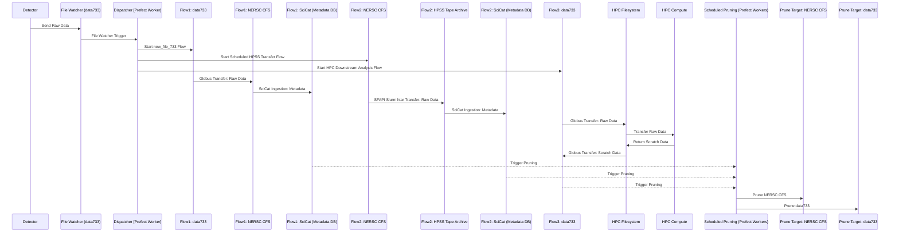
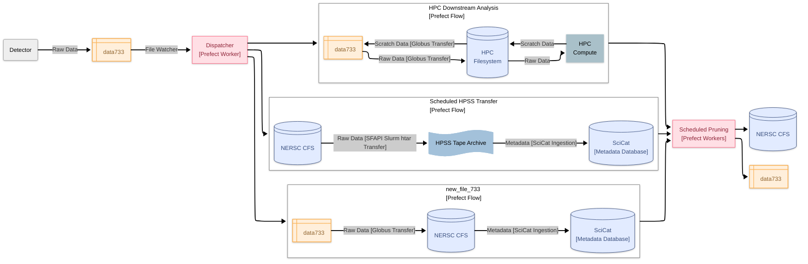

# Beamline 7.3.3 Flows

This page documents the workflows supported by Splash Flows Globus at [ALS Beamline 7.3.3 (SAXS/WAXS/GISAXS)](https://saxswaxs.lbl.gov/user-information).

## Diagrams

### Sequence Diagram

### Data Infrastructure Workflows

## File Watcher

There is a file watcher on the system `data733` that listens for new scans that have finished writing to disk. From there, a Prefect Flow we call `dispatcher` kicks off the downstream steps:
- Copy scans in real time to `NERSC CFS` using Globus Transfer.
- Copy project data to `NERSC HPSS` for long-term storage.
- Analysis on HPC systems (TBD).
- Schedule data pruning from `data733` and `NERSC CFS`.

## Prefect Configuration

### Registered Flows

#### `dispatcher.py`

#### `move.py`

## VM Details

The computing backend runs on a VM in the B15 server room that is managed by ALS IT staff.

**Name**: `flow-saxs-waxs`
**OS**: `Ubuntu 24.04 LTS`