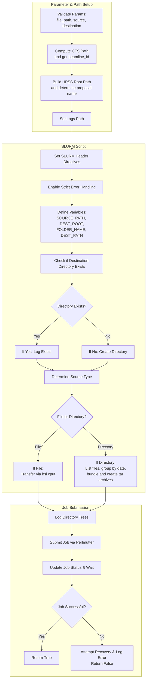

# Working with The High Performance Storage System (HPSS) at NERSC

HPSS is the tape-based data storage system we use for long term storage of experimental data at the ALS. Tape storage, while it may seem antiquated, is still a very economical and secure medium for infrequently accessed data as tape does not need to be powered except for reading and writing. This requires certain considerations when working with this system.


## Overview

**Purpose:** Archive and retrieve large experimental datasets using HPSS.
**Approach:** Use HPSS tools (hsi and htar) within a structured transfer framework orchestrated via SFAPI and SLURM jobs.
**Key Considerations:** File sizes should typically be between 100 GB and 2 TB. Larger projects are segmented into multiple archives.

### "User" in this context

It is important to clarify who users are when we talk about transferring to tape. In terms of the flows we support, that includes beamline scientists, visiting users, and computing staff. In this context, it's important to differentiate between who is collecting the data and who is doing the work of moving to and from tape. 

**NERSC Users**
  - Can move data to and from HPSS via `htar` and `hsi` commands on Perlmutter in a terminal, in Jupyter, or in a script via SFAPI as outlined below.
  - There are limitations and caveats to interacting with the tape system that users should be aware of.

**ALS Users**
  - Generate data!
  - Sometimes they are also NERSC users, and can move data to HPSS if they want.
  - Either way, we support the long term storage of data that they collect by archiving it on HPSS.

**Splash Flows Globus Users**
  - Can use the Prefect Flows and Slurm scripts provided to help perform transfers to HPSS in an automated way.
  - Have transparent and reproducible knowledge on where data is stored on tape.
  - Perform transfers that bundle data in a way that is optimized for tape storage and retrieval.
  - Apply it across different beamlines.

**Service Users**
  - We use use a service account at NERSC for automating our transfers. This "service" user can perform the same sets of tasks as other NERSC users, but has wider access to data systems. ALS Users benefit from, but do not directly interact with this account.


In `orchestration/transfer_controller.py` we have included two transfer classes for moving data from CFS to HPSS and vice versa (HPSS to CFS). We are following the [HPSS best practices](https://docs.nersc.gov/filesystems/HPSS-best-practices/) outlined in the NERSC documentation.

HPSS is intended for long-term storage of data that is not frequently accessed, and users should aim for file sizes between 100 GB and 2 TB. Since HPSS is a tape system, we need to ensure storage and retrieval commands are done efficiently, as it is a mechanical process to load in a tape and then scroll to the correct region on the tape.

While there are Globus endpoints for HPSS, the NERSC documentation recommends against it as there are certain conditions (i.e. network disconnection) that are not as robust as their recommended HPSS tools `hsi` and `htar`, which they say is the fastest approach. Together, these tools allow us to work with the HPSS filesystem and carefully bundle our projects into `tar` archives that are built directly on HPSS. Another couple of drawbacks to using Globus here is 1) if you have small files, you need to tar them regardless before transferring, and 2) HPSS does not support collab accounts (i.e. alsdev). 

## Working with `hsi`

We use `hsi` for handling individual files on HPSS. [Here is the official NERSC documentation for `hsi`.](https://docs.nersc.gov/filesystems/hsi/)


**Login to HPSS using `hsi`**

```
nersc$ hsi
```


**Common `hsi` commands**
```
hsi ls: show the contents of your HPSS home directory
hsi mkdir [new_dir]: create a remote directory in your home
hsi put [local_file_name]: Transfer a single file into HPSS with the same name
hsi put -R [local_directory]: Transfer a directory tree into HPSS, creating sub-dirs when needed
hsi get [/path/to/hpss_file]: Transfer a single file from HPSS into the local directory without renaming
hsi rm [/path/to/hpss_file]: Prune a file from HPSS
hsi rm -r [/path/to/hpss_file]: Prune a directory from HPSS
hsi rmdir /path/to/my_hpss_dir/: Prune an empty directory

```

**Examples**

Find files that are more than 20 days old and redirects the output to the file temp.txt:

```
hsi -q "find . -ctime 20" > temp.txt 2>&1
```

## Working with `htar`

We can use `htar` to efficiently work with groups of files on HPSS. The basic syntax of `htar` is similar to the standard `tar` utility:

```
htar -{c|K|t|x|X} -f tarfile [directories] [files]

-c : Create
-K : Verify existing tarfile in HPSS
-t : List
-x : Extract
-X : re-create the index file for an existing archive
```

You cannot add or append files to an existing htar file. The following examples [can also be found here](https://docs.nersc.gov/filesystems/htar/#htar-usage-examples).

**Create an archive with a directory and file**

```
nersc$ htar -cvf archive.tar project_directory some_extra_file.json
```
**List the contents of a `tar` archive**
```
nersc$ htar -tf archive.tar
HTAR: drwx------  als/als          0 2010-09-24 14:24  project_directory/cool_scan1
HTAR: -rwx------  als/als    9331200 2010-09-24 14:24  project_directory/cool_scan2
HTAR: -rwx------  als/als    9331200 2010-09-24 14:24  project_directory/cool_scan3
HTAR: -rwx------  als/als    9331200 2010-09-24 14:24  project_directory/cool_scan4
HTAR: -rwx------  als/als     398552 2010-09-24 17:35  some_extra_file.json
HTAR: HTAR SUCCESSFUL

```

**Extract the entire `htar` file**

```
htar -xvf archive.tar
```

**Extract a single file from `htar`**

```
htar -xvf archive.tar project_directory/cool_scan4
```

**`-Hnostage` option**

If your `htar` files are >100GB, and you only want to extract one or two small member files, you may find faster retrieval rates by skipping staging the file to the HPSS disk cache with `-Hnostage`.

```
htar -Hnostage -xvf archive.tar project_directory/cool_scan4
```

## Transferring Data from CFS to HPSS

NERSC provides a special `xfer` QOS ("Quality of Service") for interacting with HPSS, which we can use with our SFAPI Slurm job scripts.

### Single Files

We can transfer single files over to HPSS using `hsi put` in a Slurm script:

**Example `hsi` transfer job**

```
#SBATCH --qos=xfer
#SBATCH -C cron
#SBATCH --time=12:00:00
#SBATCH --job-name=my_transfer
#SBATCH --licenses=SCRATCH
#SBATCH --mem=20GB

# Archive a user's project folder to HPSS
hsi put /global/cfs/cdirs/als/data_mover/8.3.2/raw/als_user_project_folder/cool_scan1.h5
```

Notes:
- `xfer` jobs specifying -N nodes will be rejected at submission time. By default, `xfer` jobs get 2GB of memory allocated. The memory footprint scales somewhat with the size of the file, so if you're archiving larger files, you'll need to request more memory. You can do this by adding `#SBATCH --mem=XGB` to the above script (where X in the range of 5 - 10 GB is a good starting point for large files).
- NERSC users are at most allowed 15 concurrent `xfer` sessions, which can be used strategically for parallel transfers and reads.


### Multiple Files

NERSC recommends that when serving many files smaller than 100 GB we use `htar` to bundle them together before archiving. Since individual scans within a project may not be this large, we try to archive all of the scans in a project into a single `tar` file. If projects end up being larger than 2 TB, we can create multiple `tar` files.

One great part about `htar` is that it builds the archive directly on `HPSS`, so you do not need to worry about needing the additional storage allocation on the CFS side for the `tar` file.

**Example `xfer` transfer job**
```
#SBATCH --qos=xfer
#SBATCH -C cron
#SBATCH --time=12:00:00
#SBATCH --job-name=my_transfer
#SBATCH --licenses=SCRATCH
#SBATCH --mem=100GB

# Archive a user's project folder to HPSS
htar -cvf als_user_project.tar /global/cfs/cdirs/als/data_mover/8.3.2/raw/als_user_project_folder
```

## Transferring Data from HPSS to CFS

At some point you may want to access data from HPSS. An important thing to consider is whether you need to access single or multiple files.

You could extract an entire `htar` file

```
htar -xvf als_user_project_folder.tar
```

Or maybe a single file 

```
htar -xvf als_user_project_folder.tar cool_scan1.h5
```

## Prefect Flows for HPSS Transfers

Most of the time we expect transfers to occur from CFS to HPSS on a scheduled basis, after users have completed scanning during their alotted beamtime.

### Transfer to HPSS Implementation
**`orchestration/transfer_controller.py`:**
  - **`CFSToHPSSTransferController()`**: This controller uses a Slurm Job Script and SFAPI to launch the tape transfer job. The Slurm script handles the specific logic for handling single and multiple files, on a project by project basis. It reads the files sizes, and creates bundles that are <= 2TB. The groups within each tar archive are saved in a log on NERSC CFS for posterity.

  Here is a high level overview of the steps taken within the SFAPI Slurm Job:
   1. Define the source (CFS) and destination (HPSS) paths.
   2. Create the destination directory on HPSS if it doesn't exist.
      - Recursively check each part of the incoming file path if the folder exists
      - If the folder does not exist, use `hsi mkdir`
      - Repeat until the file path is built
   3. Determine if the source is a file or a directory.
      - If a file, transfer it using 'hsi cput'.
      - If a directory, group files by beam cycle and archive them.
         * Cycle 1: Jan 1 - Jul 15
         * Cycle 2: Jul 16 - Dec 31
         * If a group exceeds 2 TB, it is partitioned into multiple tar archives.
         * Archive names:
              `[proposal_name]_[year]-[cycle].tar`
              `[proposal_name]_[year]-[cycle]_part0.tar, _part1.tar, etc.`


**`orchestration/hpss.py`:**
- **`cfs_to_hpss_flow()`** This Prefect Flow sets up the CFSToHPSSTransferController() and calls the copy command. By registering this Flow, the HPSS transfers can be easily scheduled.


**HPSS SFAPI/Slurm Job Logic**:


### Transfer to CFS Implementation

**`orchestration/transfer_controller.py`:**
  - **`CFSToHPSSTransferController()`**: This controller uses a Slurm Job Script and SFAPI to copy data from tape to NERSC CFS. The Slurm script handles the specific logic for handling single and multiple files, on a project by project basis. Based on the file path, the Slurm job determines whether a single file or a tar archive has been requested (or even specific files within a tar archive), and run the correct routine to copy the data to CFS.
  
**`orchestration/hpss.py`:**
- **`cfs_to_hpss_flow()`** This Prefect Flow sets up the HPSSToCFSTransferController() and calls the copy command. By registering this Flow, the HPSS transfers to CFS can be easily scheduled. While copying from CFS to HPSS is likely not going to be automated, it is still helpful to have this as a Prefect Flow to simplify data access in low-code manner.


## Update SciCat with HPSS file paths

`BeamlineIngestorController()` in `orchestration/flows/scicat/ingestor_controller.py` contains a method `add_new_dataset_location()` that can be used to update the source folder and host metadata in SciCat with new HPSS location:

```python
  def add_new_dataset_location(
      self,
      dataset_id: str,
      source_folder: str,
      source_folder_host: str,
  ) -> bool:
      """
      Add a new location to an existing dataset in SciCat.

      :param dataset_id:          SciCat ID of the dataset.
      :param source_folder:       "Absolute file path on file server containing the files of this dataset,
                                  e.g. /some/path/to/sourcefolder. In case of a single file dataset, e.g. HDF5 data,
                                  it contains the path up to, but excluding the filename. Trailing slashes are removed.",

      :param source_folder_host: "DNS host name of file server hosting sourceFolder,
                                  optionally including a protocol e.g. [protocol://]fileserver1.example.com",

      """
      dataset = self.scicat_client.datasets_get_one(dataset_id)
      # sourceFolder sourceFolderHost are each a string
      dataset["sourceFolder"] = source_folder
      dataset["sourceFolderHost"] = source_folder_host
      self.scicat_client.datasets_update(dataset, dataset_id)
      logger.info(f"Added location {source_folder} to dataset {dataset_id}")
      return dataset_id
```