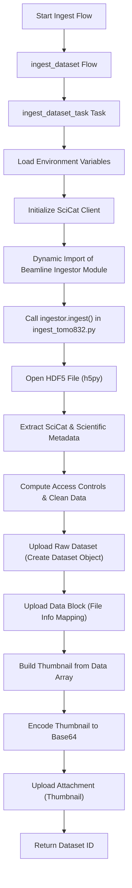

# SciCat

## Overview
SciCat is a data management system for scientific data. It provides tools to manage, organize, and share research data effectively.

## Features
- **Data Management**: Efficient storage and organization of scientific datasets.
- **User Authentication**: Secure access control for users.
- **Metadata Management**: Manage metadata associated with your data.
- **Data Sharing**: Share data securely with collaborators.
- **Integration**: Integrate with other tools and workflows.

## Workflow Diagram

## Getting Started

In `splash_flows_globus`, we "ingest" our datasets into SciCat during our file movement workflows. In the directory `orchestration/flows/scicat/` there are two general scripts: `ingest.py` and `utils.py`. Since the data from each beamline is different, we define specific ingest implementations, such as `orchestration/flows/bl832/ingest_tomo832.py`.

# SciCat Client API Documentation

This document details the API provided by the `ScicatClient` class and its associated utility functions for interacting with the SciCat Catamel server.

---

## Overview

The `ScicatClient` class offers a comprehensive interface for communicating with the SciCat server via HTTP. It supports operations such as creating, updating, retrieving, and deleting datasets, samples, instruments, proposals, and published data. The client utilizes token-based authentication and provides helper functions to work with file metadata and image encoding.

---

## ScicatClient Class

### Initialization

    ScicatClient(
        base_url: str,
        token: Optional[str] = None,
        username: Optional[str] = None,
        password: Optional[str] = None,
        timeout_seconds: Optional[int] = None
    )

- **Parameters:**
  - `base_url`: Base URL for the SciCat API (e.g., "http://localhost:3000/api/v3/").
  - `token`: (Optional) A pre-obtained authentication token.
  - `username`: (Optional) Username for login.
  - `password`: (Optional) Password for login.
  - `timeout_seconds`: (Optional) Timeout in seconds for HTTP requests.
- **Behavior:** If no token is provided, the client attempts to log in using the provided username and password, retrieves a token, and sets the appropriate HTTP headers.
- **Raises:** An assertion error if neither a token nor valid login credentials are provided.

---

### Internal Methods

#### _send_to_scicat

    _send_to_scicat(cmd: str, endpoint: str, data: Optional[BaseModel] = None)

- **Purpose:** Sends an HTTP request to the SciCat server.
- **Parameters:**
  - `cmd`: The HTTP method (e.g., "post", "patch", "get", "delete").
  - `endpoint`: API endpoint to append to the base URL.
  - `data`: (Optional) A `pydantic.BaseModel` instance representing the payload.
- **Returns:** The HTTP response object from the request.

#### _call_endpoint

    _call_endpoint(
        cmd: str,
        endpoint: str,
        data: Optional[BaseModel] = None,
        operation: str = ""
    ) -> Optional[dict]

- **Purpose:** Calls a specific API endpoint, handles JSON parsing, and checks for errors.
- **Parameters:**
  - `cmd`: The HTTP method.
  - `endpoint`: The specific endpoint to call.
  - `data`: (Optional) Data to include in the request body.
  - `operation`: (Optional) A string identifier for the operation, used in logging.
- **Returns:** A dictionary containing the parsed JSON response.
- **Raises:** `ScicatCommError` if the server responds with an error status.

---

## Dataset Operations

### Create Dataset

    datasets_create(dataset: Dataset) -> str

- **Purpose:** Uploads a new dataset.
- **Parameters:**
  - `dataset`: An instance of the `Dataset` model.
- **Returns:** A string representing the unique identifier (PID) of the created dataset.
- **Aliases:** `upload_new_dataset`, `create_dataset`.

### Update Dataset

    datasets_update(dataset: Dataset, pid: str) -> str

- **Purpose:** Updates an existing dataset.
- **Parameters:**
  - `dataset`: An instance of the `Dataset` model with updated fields.
  - `pid`: The unique identifier of the dataset to update.
- **Returns:** A string representing the updated dataset's PID.
- **Alias:** `update_dataset`.

### Create Dataset OrigDatablock

    datasets_origdatablock_create(
        dataset_id: str,
        datablockDto: CreateDatasetOrigDatablockDto
    ) -> dict

- **Purpose:** Creates an original datablock for a specified dataset.
- **Parameters:**
  - `dataset_id`: The unique identifier of the dataset.
  - `datablockDto`: A data transfer object containing the datablock details.
- **Returns:** A dictionary representing the created datablock.
- **Aliases:** `upload_dataset_origdatablock`, `create_dataset_origdatablock`.

### Create Dataset Attachment

    datasets_attachment_create(
        attachment: Attachment,
        datasetType: str = "Datasets"
    ) -> dict

- **Purpose:** Uploads an attachment to a dataset.
- **Parameters:**
  - `attachment`: An instance of the `Attachment` model.
  - `datasetType`: (Optional) The type of dataset; default is "Datasets".
- **Returns:** A dictionary containing details of the uploaded attachment.
- **Aliases:** `upload_attachment`, `create_dataset_attachment`.

### Find Datasets (Full Query)

    datasets_find(
        skip: int = 0,
        limit: int = 25,
        query_fields: Optional[dict] = None
    ) -> Optional[dict]

- **Purpose:** Retrieves datasets using a full text search query.
- **Parameters:**
  - `skip`: Number of records to skip (for pagination).
  - `limit`: Maximum number of records to return.
  - `query_fields`: (Optional) A dictionary specifying search criteria.
- **Returns:** A dictionary with the query results.
- **Aliases:** `get_datasets_full_query`, `find_datasets_full_query`.

### Get Many Datasets (Simple Filter)

    datasets_get_many(filter_fields: Optional[dict] = None) -> Optional[dict]

- **Purpose:** Retrieves datasets based on simple filtering criteria.
- **Parameters:**
  - `filter_fields`: A dictionary containing the filter conditions.
- **Returns:** A dictionary with the filtered datasets.
- **Aliases:** `get_datasets`, `find_datasets`.

### Get Single Dataset

    datasets_get_one(pid: str) -> Optional[dict]

- **Purpose:** Retrieves a single dataset by its PID.
- **Parameters:**
  - `pid`: The unique identifier of the dataset.
- **Returns:** A dictionary with the dataset details.
- **Alias:** `get_dataset_by_pid`.

### Delete Dataset

    datasets_delete(pid: str) -> Optional[dict]

- **Purpose:** Deletes a dataset identified by its PID.
- **Parameters:**
  - `pid`: The unique identifier of the dataset to delete.
- **Returns:** A dictionary containing the server's response.
- **Alias:** `delete_dataset`.

---

## Sample Operations

### Create Sample

    samples_create(sample: Sample) -> str

- **Purpose:** Creates a new sample.
- **Parameters:**
  - `sample`: An instance of the `Sample` model.
- **Returns:** A string representing the newly created sample ID.
- **Alias:** `upload_sample`.

### Update Sample

    samples_update(sample: Sample, sampleId: Optional[str] = None) -> str

- **Purpose:** Updates an existing sample.
- **Parameters:**
  - `sample`: An instance of the `Sample` model with updated values.
  - `sampleId`: (Optional) The unique identifier of the sample; if omitted, the sample’s own `sampleId` is used.
- **Returns:** A string representing the updated sample ID.

### Get Single Sample

    samples_get_one(pid: str) -> Optional[dict]

- **Purpose:** Retrieves a sample by its PID.
- **Parameters:**
  - `pid`: The unique sample identifier.
- **Returns:** A dictionary with the sample details.
- **Alias:** `get_sample`.

---

## Instrument Operations

### Create Instrument

    instruments_create(instrument: Instrument) -> str

- **Purpose:** Creates a new instrument. Admin rights may be required.
- **Parameters:**
  - `instrument`: An instance of the `Instrument` model.
- **Returns:** A string representing the instrument's unique identifier (PID).
- **Alias:** `upload_instrument`.

### Update Instrument

    instruments_update(instrument: Instrument, pid: Optional[str] = None) -> str

- **Purpose:** Updates an existing instrument.
- **Parameters:**
  - `instrument`: An instance of the `Instrument` model with updated fields.
  - `pid`: (Optional) The unique identifier of the instrument; if omitted, the instrument’s own `pid` is used.
- **Returns:** A string representing the updated instrument PID.

### Get Single Instrument

    instruments_get_one(pid: Optional[str] = None, name: Optional[str] = None) -> Optional[dict]

- **Purpose:** Retrieves an instrument by its PID or by name.
- **Parameters:**
  - `pid`: (Optional) The unique instrument identifier.
  - `name`: (Optional) The instrument name (used if PID is not provided).
- **Returns:** A dictionary with the instrument details.
- **Alias:** `get_instrument`.

---

## Proposal Operations

### Create Proposal

    proposals_create(proposal: Proposal) -> str

- **Purpose:** Creates a new proposal. Admin rights may be required.
- **Parameters:**
  - `proposal`: An instance of the `Proposal` model.
- **Returns:** A string representing the newly created proposal ID.
- **Alias:** `upload_proposal`.

### Update Proposal

    proposals_update(proposal: Proposal, proposalId: Optional[str] = None) -> str

- **Purpose:** Updates an existing proposal.
- **Parameters:**
  - `proposal`: An instance of the `Proposal` model with updated information.
  - `proposalId`: (Optional) The unique identifier of the proposal; if omitted, the proposal’s own `proposalId` is used.
- **Returns:** A string representing the updated proposal ID.

### Get Single Proposal

    proposals_get_one(pid: str) -> Optional[dict]

- **Purpose:** Retrieves a proposal by its PID.
- **Parameters:**
  - `pid`: The unique proposal identifier.
- **Returns:** A dictionary with the proposal details.
- **Alias:** `get_proposal`.

---

## Published Data Operations

### Get Published Data

    published_data_get_many(filter=None) -> Optional[dict]

- **Purpose:** Retrieves published datasets based on optional filter criteria.
- **Parameters:**
  - `filter`: (Optional) A dictionary specifying filter conditions.
- **Returns:** A dictionary containing the published data.
- **Aliases:** `get_published_data`, `find_published_data`.

---

## Additional Dataset Operations

### Get Dataset OrigDatablocks

    datasets_origdatablocks_get_one(pid: str) -> Optional[dict]

- **Purpose:** Retrieves the original datablocks associated with a dataset.
- **Parameters:**
  - `pid`: The unique identifier of the dataset.
- **Returns:** A dictionary with the original datablock details.
- **Alias:** `get_dataset_origdatablocks`.

---

## Utility Functions

### File Utilities

#### Get File Size

    get_file_size(pathobj: Path)

- **Purpose:** Returns the size of a file in bytes.
- **Parameters:**
  - `pathobj`: A `Path` object representing the file.
- **Returns:** The file size as an integer.

#### Get Checksum

    get_checksum(pathobj: Path)

- **Purpose:** Computes the MD5 checksum of a file.
- **Parameters:**
  - `pathobj`: A `Path` object representing the file.
- **Returns:** The MD5 checksum as a hexadecimal string.

#### Encode Thumbnail

    encode_thumbnail(filename, imType="jpg")

- **Purpose:** Encodes an image file as a Base64 data URL, suitable for use as a thumbnail.
- **Parameters:**
  - `filename`: Path to the image file.
  - `imType`: (Optional) Image format (default is "jpg").
- **Returns:** A string containing the Base64 encoded image prefixed with the appropriate data URL header.

#### Get File Modification Time

    get_file_mod_time(pathobj: Path)

- **Purpose:** Retrieves the last modification time of a file.
- **Parameters:**
  - `pathobj`: A `Path` object representing the file.
- **Returns:** A string representation of the file's modification time.

### Authentication Helpers

#### Create Client from Token

    from_token(base_url: str, token: str)

- **Purpose:** Instantiates a `ScicatClient` using an existing authentication token.
- **Parameters:**
  - `base_url`: Base URL for the SciCat API.
  - `token`: A valid authentication token.
- **Returns:** An instance of `ScicatClient`.

#### Create Client from Credentials

    from_credentials(base_url: str, username: str, password: str)

- **Purpose:** Instantiates a `ScicatClient` by logging in with username and password.
- **Parameters:**
  - `base_url`: Base URL for the SciCat API.
  - `username`: Login username.
  - `password`: Login password.
- **Returns:** An instance of `ScicatClient`.

#### Retrieve Token

    get_token(base_url, username, password)

- **Purpose:** Logs in using provided credentials and retrieves an authentication token.
- **Parameters:**
  - `base_url`: Base URL for the SciCat API.
  - `username`: Login username.
  - `password`: Login password.
- **Returns:** An authentication token as a string.
- **Behavior:** Attempts login via the `Users/login` and `auth/msad` endpoints.

---

## Exception Classes

- **ScicatLoginError**
  - Raised when an error occurs during the login process.
  - Contains an error message describing the issue.

- **ScicatCommError**
  - Raised when communication with the SciCat server fails (non-20x HTTP responses).
  - Contains an error message describing the issue.
