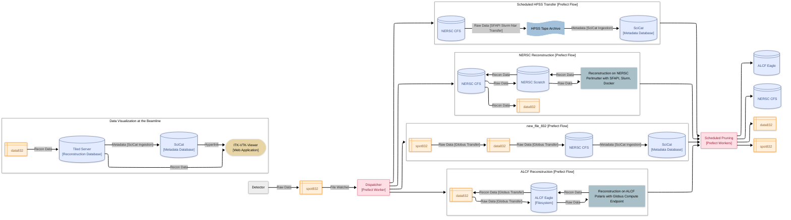

```mermaid

---
config:
  theme: neo
  layout: elk
  look: neo
---
flowchart LR
 subgraph s2["ALCF Reconstruction [Prefect Flow]"]
        n17["data832"]
        n18["ALCF Eagle<br>[Filesystem]"]
        n26["Reconstruction on ALCF Polaris with Globus Compute Endpoint"]
  end
 subgraph s1["new_file_832 [Prefect Flow]"]
        n20["data832"]
        n21["NERSC CFS"]
        n22@{ label: "SciCat<br style=\"--tw-scale-x:\">[Metadata Database]" }
        n46["spot832"]
  end
 subgraph s3["NERSC Reconstruction [Prefect Flow]"]
        n28["NERSC CFS"]
        n29["NERSC Scratch"]
        n30["Reconstruction on NERSC Perlmutter with SFAPI, Slurm, Docker"]
        n42["data832"]
  end
 subgraph s4["Scheduled HPSS Transfer [Prefect Flow]"]
        n38["NERSC CFS"]
        n39["HPSS Tape Archive"]
        n40["SciCat <br>[Metadata Database]"]
  end
 subgraph s5["Data Visualization at the Beamline"]
        n41["data832"]
        n43["Tiled Server<br>[Reconstruction Database]"]
        n44(["ITK-VTK-Viewer<br>[Web Application]"])
        n45["SciCat<br>[Metadata Database]"]
  end
    n17 -- Raw Data [Globus Transfer] --> n18
    n23["spot832"] -- File Watcher --> n24["Dispatcher<br>[Prefect Worker]"]
    n25["Detector"] -- Raw Data --> n23
    n24 --> s2 & s1 & s3 & s4
    n20 -- Raw Data [Globus Transfer] --> n21
    n21 -- "<span style=color:>Metadata [SciCat Ingestion]</span>" --> n22
    n18 -- Raw Data --> n26
    n26 -- Recon Data --> n18
    n18 -- Recon Data [Globus Transfer] --> n17
    n28 -- Raw Data --> n29
    n29 -- Raw Data --> n30
    n29 -- Recon Data --> n28
    n30 -- Recon Data --> n29
    s1 --> n32["Scheduled Pruning <br>[Prefect Workers]"]
    s3 --> n32
    s2 --> n32
    n32 --> n33["ALCF Eagle"] & n35["NERSC CFS"] & n34["data832"] & n36["spot832"]
    n38 -- Raw Data [SFAPI Slurm htar Transfer] --> n39
    s4 --> n32
    n39 -- "<span style=color:>Metadata [SciCat Ingestion]</span>" --> n40
    n28 -- "<span style=color:>Recon Data</span>" --> n42
    n41 -- Recon Data --> n43
    n43 -- Recon Data --> n44
    n43 -- Metadata [SciCat Ingestion] --> n45
    n45 -- Hyperlink --> n44
    n46 -- "<span style=color:>Raw Data [Globus Transfer]</span>" --> n20
    n17@{ shape: internal-storage}
    n18@{ shape: disk}
    n20@{ shape: internal-storage}
    n21@{ shape: disk}
    n22@{ shape: db}
    n46@{ shape: internal-storage}
    n28@{ shape: disk}
    n29@{ shape: disk}
    n42@{ shape: internal-storage}
    n38@{ shape: disk}
    n39@{ shape: paper-tape}
    n40@{ shape: db}
    n41@{ shape: internal-storage}
    n43@{ shape: db}
    n45@{ shape: db}
    n23@{ shape: internal-storage}
    n24@{ shape: rect}
    n25@{ shape: rounded}
    n33@{ shape: disk}
    n35@{ shape: disk}
    n34@{ shape: internal-storage}
    n36@{ shape: internal-storage}
     n17:::storage
     n17:::Peach
     n18:::storage
     n18:::Sky
     n26:::compute
     n20:::storage
     n20:::Peach
     n21:::Sky
     n22:::Sky
     n46:::collection
     n46:::storage
     n46:::Peach
     n28:::Sky
     n29:::storage
     n29:::Sky
     n30:::compute
     n42:::Peach
     n38:::Sky
     n39:::storage
     n40:::Sky
     n41:::Peach
     n43:::Sky
     n44:::visualization
     n45:::Sky
     n23:::collection
     n23:::storage
     n23:::Peach
     n24:::collection
     n24:::Rose
     n25:::Ash
     n32:::Rose
     n33:::Sky
     n35:::Sky
     n34:::Peach
     n36:::Peach
    classDef collection fill:#D3A6A1, stroke:#D3A6A1, stroke-width:2px, color:#000000
    classDef compute fill:#A9C0C9, stroke:#A9C0C9, stroke-width:2px, color:#000000
    classDef Rose stroke-width:1px, stroke-dasharray:none, stroke:#FF5978, fill:#FFDFE5, color:#8E2236
    classDef storage fill:#A3C1DA, stroke:#A3C1DA, stroke-width:2px, color:#000000
    classDef Ash stroke-width:1px, stroke-dasharray:none, stroke:#999999, fill:#EEEEEE, color:#000000
    classDef Peach stroke-width:1px, stroke-dasharray:none, stroke:#FBB35A, fill:#FFEFDB, color:#8F632D
    classDef visualization fill:#E8D5A6, stroke:#E8D5A6, stroke-width:2px, color:#000000
    classDef Sky stroke-width:1px, stroke-dasharray:none, stroke:#374D7C, fill:#E2EBFF, color:#374D7C
    style s2 stroke:#757575
    style s1 stroke:#757575
    style s3 stroke:#757575
    style s4 stroke:#757575
    style s5 stroke:#757575

```